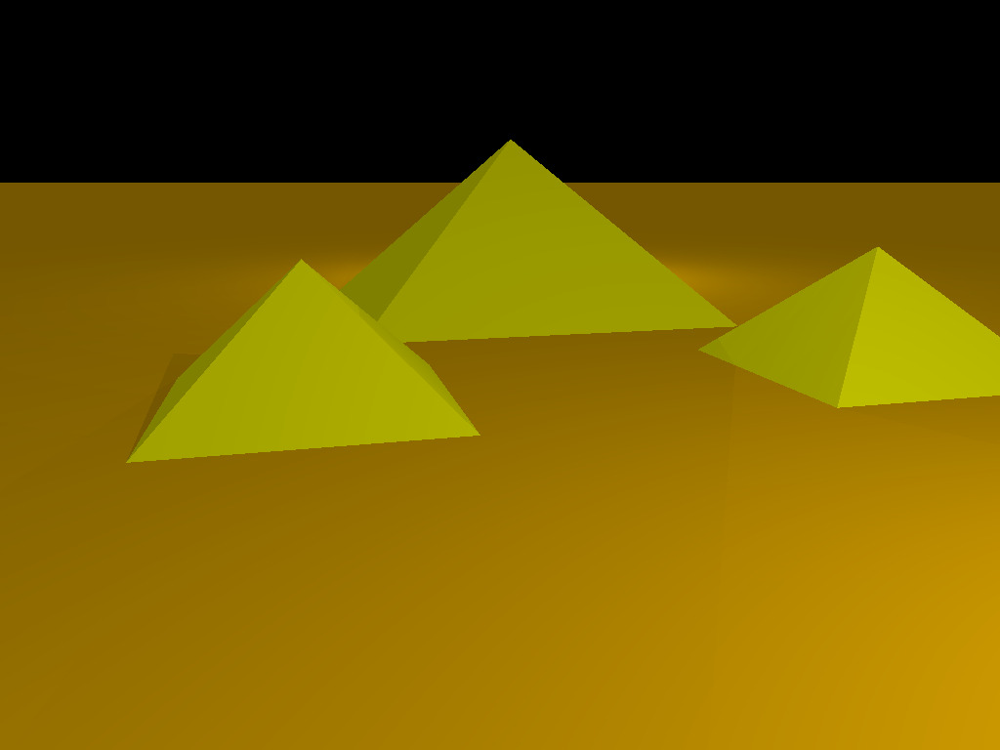

# miniRT
Simple ray-tracer program written in C. Takes a scene file and renders its content on a Xorg instance, or export it to a bitmap file.

## Motivation
This project was made as part of the 42 São Paulo curriculum, with the main pedagogic focus on the computer graphics branch. A [raytracer](https://en.wikipedia.org/wiki/Ray_tracing_(graphics)) is a special algorithm, developed to render tridimensional scenes with the highest level of realism. To acheive this result, a raytracer calculates the intersection of a ray if light, originated from the camera of the spectator, to the objects in the scene. The physical properties of the ray can be simulated with precision, so a modest raytracer can render lights, shadows and surfaces with a reasonable degree of fidelity.

---

## Dependencies

To be able to run this program smoothly on your machine, make sure that you have installed on your machine all of the following libraries.

    libxext-dev
    libxrandr-dev
    libx11-dev
    libbsd-dev
    libssl-dev

## Compilation and Execution

The compilation is made upon the execution of the `make` command on the root directory. The `minilibx`, `libft` and `libvector` libraries will be compiled, with further linking to main project in the sequence. The execution of this program can be made with two different commands:

    ./miniRT <scene-file.rt>
    ./miniRT <scene-file.rt> --save
    
The first command takes a scene file and renderizes it with a new X Server instance. By using this method, the user can iterate through several cameras on the scene, changing the perspective in any way desired. If the scene resolution is greater than the screen dimensions, the window will be resized to the maximum screen size.

The second command doesn't open a new window with a live scene, but renders the image present at the first camera available and export the image to a *bitmap* file. The bitmap header follows the 40 bit DIB size standard (BITMAPINFOHEADER), with 24 bits color. The screen size restriction does not apply to this rendering option, so it's possible to generate scene images with resolution greater than the screen.

---

# The RayTracer

## General Information

This program can render the following primitive euclidian objects:

- Spheres
- Planes
- Squares
- Cylinders
- Triangles

Besides the primitives, the raytracer takes information of *cameras*, *spherical lights*, *ambient light* and *screen resolution* into the scene. Only one resolution and ambient lighting may be declared into the scene; less or more will raise execution errors.

### Coordinates System

The entire vecotr space in which this program is built is a cartesian tridimensional space, based on an orthonormal basis. Therefore, the distance between unit interval along all axis is the same, and, with a camera with viewport based on the *x* and *y* axis, the orientation vector will point to the *-z* axis. As counterintuitive it seems, it's easy to proof with the right-hand rule. The following image describes how a camera sees the viewport, with an inverted *-z* axis. 

## Describing a Scene

A mini raytracing scene can be identified by several elements, described on different lines on a `<.rt>` file. Each line must be initiated with an element identifier, which could comprises one or two characters, followed by parameters separated by one or more whitespaces.

Vector, point or color parameters must have each component separated by commas. All the color components must be in the range `[0; 255]`.

Empty lines on the scene file will not be accounted, and lines starting with `#` will be considered comments.

Here are some boilerplates to create a scene based on the `miniRT` scene identifiers. I'm gonna show up with examples and then explain briefly its effect on the scene and possible restrictions.

###### Resolution

    R    x    y

- `R` (**char**): Resolution identifier;
- `x` (**unsigned int**): Image resolution on the X axis;
- `y` (**unsigned int**): Image resolution on the Y axis.

Example: `R  800  600`

Note: This element is mandatory, and must be unique.

###### Ambient Lighting

    A    intensity    color

- `A` (**char**): Ambient lighting identifier;
- `intensity` (**float in range [0; 1]**): Ambient light overall intensity;
- `color` (**int[3] in range [0; 255]**): Ambient lighting color in RGB format.

Example: `A   0.4   255,255,255`

Note: This element is mandatory, and must be unique.

###### Cameras

    c    origin    orientation    fov

- `c` (**char**): Camera identifier;
- `origin` (**float[3]**): Camera origin point in the vector space
- `orientation` (**float[3] in range [-1; 1]**): Normalized camera orientation vector in the vector space.
- `fov` (**float**): Camera field of view, in degrees.

Example: `c    0,1,1    0,-0.25,-0.75    66`

###### Lights

    l    origin    intensity    color

- `l` (**char**): Light identifier;
- `origin` (**float[3]**): Point of origin of the spherical light;
- `intensity` (**float in range [0; 1]**): Light overall intensity, decreasing with the square of the distance;
- `color` (**int[3] in range [0; 255]**): Light color in RGB format.

Example: `l    0,4,3    0.25    0,255,0`

###### Planes

    pl    origin    normal    color

- `l` (**char * **): Plane identifier;
- `origin` (**float[3]**): Plane origin point in the vector space;
- `normal` (**float[3] in range [-1; 1]**): Normalizad plane orientation vector in the vector space;
- `color` (**int[3] in range [0; 255]**): Plane color in RGB format.

Example: `pl    0,-1,0    0,1,0    255,255,0`
